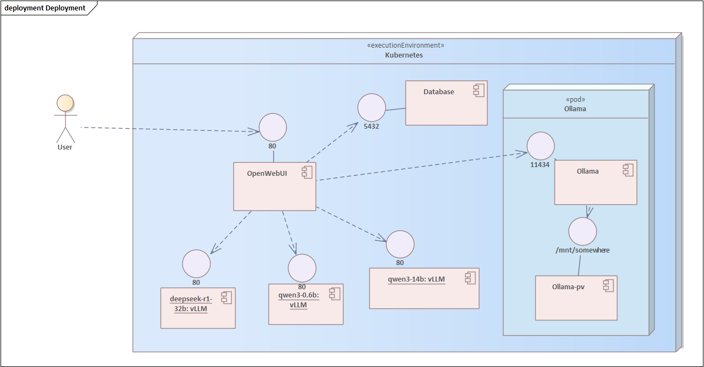

# Kubernetes Deployment

## Directory structure

The deployment is organised into three main directories:

```
.
├── base                           # Core Kubernetes configurations (namespace, storage class, etc.)
├── monitoring                     # Monitoring setup for K3s and vLLM services using Prometheus and Grafana
└── services                       # Application services comprising SotonGPT
    ├── ollama-background-tasks    # Ollama instance for background tasks in Open WebUI
    ├── vllm                       # vLLM inference servers, with each subdirectory representing a model deployment
    │   ├── llama3-70b
    │   ├── qwen2_5-14b-instruct
    │   ├── qwen2_5-32b-instruct
    │   ├── qwen2_5-7b-instruct
    │   ├── qwen3-32b
    │   ├── secrets                # Secrets for vLLM servers, e.g., HF_TOKEN
    │   └── tiny-llama
    ├── web-chat                   # Open WebUI web chat interface
    └── web-chat-database          # PostgreSQL database with pgvector for Open WebUI
```

The `base` and `monitoring` directories contain infrastructure-related manifests for cluster setup and observability. The `services` directory houses the core application components.

## Deployment diagram



## Open WebUI

SotonGPT uses [Open WebUI](https://openwebui.com/) to serve an interactive chat for non-technical users, and also serves multiple API endpoints for more technical users. The API allows direct communication with the LLMs bypassing the chat window, and acts as a centralised model hub with a consistent interface between Ollama and vLLM servers.

The manifests to deploy Open WebUI are kept in the `services/web-chat` directory:

```
.
├── deployment.yaml
├── ingress.yaml
├── kustomization.yaml
├── pv.yaml
├── pvc.yaml
└── service.yaml
```

SotonGPT uses v0.8.3 of Open WebUI. The pod exposes port 8080, forwarded to port 80 via the ingress at
[http://sotongpt.soton.ac.uk](http://sotongpt.soton.ac.uk). Environment variables for performance are documented in
`deployment.yaml`. Only 1 replica of Open WebUI is run. If required, Open WebUI can run multiple replicas with Redis,
see [here](https://docs.openwebui.com/troubleshooting/multi-replica/) for more details.

### PostgreSQL database

A PostgreSQL database with pgvector support is used as the relational and vector database backend. PostgreSQL stores
user information, chats, and file IDs. pgvector handles the processed embeddings for files uploaded. Without either of
these backends, Open WebUI is practically unusable with concurrent users.

### Authenticated login

TODO: this will allow login using university credentials.

## Ollama services

Ollama serves models for background tasks in Open WebUI, such as generating tags, titles, and embeddings for documents.
On deployment, a one-time job downloads the gemma3:1b and nomic-embed-text models used for text and embedding
generation, respectively. The Ollama service runs entirely on the CPU. It should therefore not be used to generate text
in a chat with a user.

## vLLM services

vLLM is a high-performance inference engine designed specifically for large language models (LLMs). It serves as the
primary backend for handling user queries in SotonGPT, providing efficient and scalable inference for multiple model
variants. While Ollama is suitable for lightweight, background tasks, vLLM is the backbone of SotonGPT due to its
superior performance and scalability:

- **High throughput**: vLLM uses techniques like PagedAttention and continuous batching to process multiple requests
  simultaneously, achieving significantly higher throughput for inference.
- **Low latency**: vLLM has low time-to-first-token and inter-token latency, crucial for interactive chat applications.
- **Scalability**: Easily scales across multiple GPUs.
- **Model support**: Broad compatibility with popular open-source models, including those from Meta, Mistral, and Qwen.

However, there are several weaknesses with vLLM:

- **Activate energy**: Steeper learning curve for deployment and optimisation.
- **Complexity**: Requires more setup and configuration compared to Ollama.
- **Resource intensive**: Demands powerful GPUs and significant memory, increasing infrastructure costs.
- **Overhead**: Additional latency for very small models or single requests due to batching overhead.

### Components

Unlike Ollama, vLLM can only serve one model at once. Therefore each  directory in `services/vllm` is a deployment for a
different LLM. Each deployment includes:

- **deployment.yaml**: Defines pod specifications, resource limits, and container configuration.
- **pv.yaml** & **pvc.yaml**: Persistent storage for storing model weights and used for caching.
- **service.yaml**: Kubernetes service for discovery.
- **kustomization.yaml**: Kustomization file, defining the components of a vLLM deployment.

There is no default set of vLLM models. The currently provided models will all fit and perform *good enough* on either
one or two RTX 8000s.

### Hardware and other limitations

vLLM deployments are resource-intensive and state-of-the-art (SOTA) models also have specific requirements.
Understanding these constraints is essential when selecting models to deploy.  The RTX 8000 GPUs available on the
SotonGPT host are based on NVIDIA's Turing architecture (Compute Capability 7.5). This has significant implications for
model compatibility:

- No bfloat16 support: Turing GPUs do not support the bfloat16 data type. Most SOTA models released after 2023 are
  trained and released exclusively in bf16. vLLM must therefore use float16 instead, which degrades performance for some
  models.
- No FlashAttention 2: FA2 requires Compute Capability (CC) 8.0 (Ampere) or higher. The RTX 8000 has CC 7.5, meaning
  vLLM will fall back to slower attention implementations.

In practice, these architectural limitations mean that many models which would otherwise fit within the available VRAM
of something more modern like an L40, simply cannot be deployed on RTX 8000s regardless of their size. For example,
Google's gemma3:7b model does not load and nor does OpenAI's gpt-oss:20b.

#### VRAM requirements beyond model weights

Each RTX 8000 has 48 GB of VRAM, and a two-GPU tensor-parallel configuration (splitting the model weights across two
GPUs) provides 96 GB VRAM in total. However, the raw model weights represent only a fraction of the total VRAM consumed
by vLLM. vLLM's memory usage is dominated by two additional components:

- **KV cache**: The key-value cache stores the attention keys and values for all tokens in the current batch of active
requests. Its size scales with the number of concurrent users, the maximum context length, the architecture of the
models (such as number of layers) and the data type in use. For a model with a large context window and many concurrent
users, the KV cache can easily consume several times the memory used by the model weights themselves. For example, a 7B
parameter model loaded in float16 requires roughly 14 GB for weights alone, but serving 50 concurrent users with 8k
context lengths could demand an additional 20–40 GB of KV cache depending on the model architecture. vLLM pre-allocates
KV cache at startup (controlled by `--gpu-memory-utilization`), so the number of requests that can be batched
simultaneously is constrained by whatever VRAM remains after the weights are loaded.
- **CUDA and framework overhead**: PyTorch, the CUDA runtime, and vLLM's own internal buffers consume several gigabytes
of VRAM before any model is loaded. This overhead is typically in the range of 2–4 GB per GPU.

The practical consequence is that even a model whose weights comfortably fit within available VRAM may leave
insufficient room for a meaningful KV cache. This results in poor concurrency and high queuing latency under load, or
vLLM may even fail to load the model.

When evaluating whether a model is suitable for deployment, the question is not just "do the weights fit?" but "do the
weights fit and leave enough room for a KV cache?"

#### Model selection guidance

Given the above, models suitable for deployment on one or two RTX 8000s must satisfy all of the following: they must be
loadable in float16 (not exclusively bf16), must not require FP8 or other unsupported quantisation formats, must fit in
VRAM with sufficient headroom for the KV cache, and must not require Compute Capability 8.0+ features. In practice this
significantly restricts the choice of SOTA models, and newer flagship models from most providers are unlikely to be
compatible.

## Admin dashboard

The admin dashboard uses Grafana to show service health, LLM performance, user analytics, infrastructure monitoring, and
alerting. Deployed via Helm in the `monitoring` directory.

Each vLLM deployment exposes a Prometheus /metrics endpoint scraped via a ServiceMonitor resource. Metrics cover request
performance (time-to-first-token, inter-token latency, end-to-end latency), throughput (tokens per second), and memory
health (KV cache utilisation and request queue depth). These are surfaced in the Grafana admin dashboard described
below, with panels broken down per model to make it straightforward to identify which deployment is under pressure.
